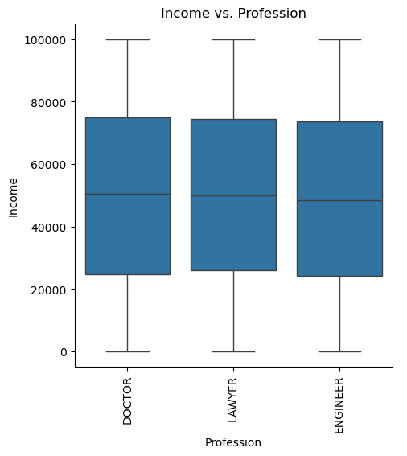
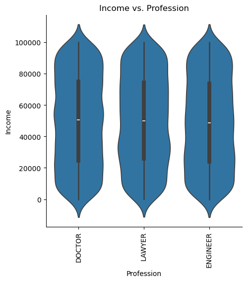

# Fraud Detection Binary Classification

### [dataset](https://www.kaggle.com/datasets/sameerk2004/fraud-detection-dataset)

Author: [Kevin Thomas](mailto:ket189@pitt.edu)

License: No license information was provided.

## **Executive Summary**

### **Objective**

This report presents an analysis of demographic and occupational data focusing on income distribution across professions. Using visualizations and a basic binary classification model, we aimed to explore any patterns or associations within this dataset.

### **Data Insights**

**1. Income Distribution Analysis**
- **Income Distribution:** The histogram with KDE line shows a marginal distribution of income ranging from 0 to 100,000. This distribution is relatively uniform, with consistent counts across income intervals. The smooth, flat KDE line reflects this uniformity, indicating no significant clustering or peaks, which suggests that income is evenly spread throughout the dataset.

**2. Profession Distribution Analysis**
- **Profession Counts:** The bar chart illustrates similar counts across the professions of doctors, lawyers, and engineers, with a slightly higher count for doctors, followed by lawyers and then engineers. This balance indicates a well-represented sample across these professions, allowing for fair comparison of characteristics within these groups.

**3. Income by Profession Analysis**
- **Income Comparison Across Professions:** Box plots show similar median income levels across doctors, lawyers, and engineers, with wide interquartile ranges, suggesting variability within each profession but comparable medians. The error bar plot further supports this, with mean incomes closely aligned and overlapping confidence intervals, suggesting minimal differences in average income between professions.

### **Model Development and Selection**

**Model Evaluation**
- **Model Performance:** The selected model achieved an accuracy of 51.35% and an ROC AUC of 51.03%, barely above random guessing, indicating limited predictive utility. The model included six coefficients, but only one—specifically the profession category "Engineer"—was statistically significant, with a coefficient of -0.1740 (p-value = 0.0075), suggesting a slight negative association with the target variable. The use of higher-order terms for income did not yield significant results, underscoring the model's lack of predictive strength.

### **Implications**

The model’s near-random performance underscores its limited practical application, as it fails to provide meaningful predictions or insights. The analysis of income distribution by profession suggests minimal variation across professional categories, and the model’s lack of robust predictive power further confirms that these features do not strongly differentiate the target outcome.

### **Recommendations and Next Steps**

1. **Improvement of Model Features:** Consider including additional relevant demographic or lifestyle variables to enhance predictive power.
2. **Alternative Modeling Approaches:** Explore other algorithms that may be more suited to uncovering subtle relationships within this dataset.
3. **Avoid Practical Application:** Due to its low accuracy and ROC AUC, this model should not be used for any decision-making processes.

### **Conclusion**

This analysis indicates that the current dataset lacks substantial variation in income distribution across the professions of doctors, lawyers, and engineers. The selected model’s low accuracy and ROC AUC further confirm that it is unsuitable for predictive applications. Future analyses with additional features and more refined modeling techniques are recommended. **This model should never be used in production due to its poor predictive performance.**

## Import Main Modules & Dataset


```python
import numpy as np
import pandas as pd
import matplotlib.pyplot as plt
import seaborn as sns
```


```python
import itertools
```


```python
import statsmodels.formula.api as smf
```


```python
df = pd.read_csv('data2.csv')
```

## Perform Basic Analysis


```python
df.shape
```


    (10000, 6)


```python
df.dtypes
```


    Profession            object
    Income                 int64
    Credit_card_number     int64
    Expiry                object
    Security_code          int64
    Fraud                  int64
    dtype: object


```python
_ = [print(f'{df[column].value_counts()}\n') for column in df.columns]
```

    Profession
    DOCTOR      3379
    LAWYER      3357
    ENGINEER    3264
    Name: count, dtype: int64
    
    Income
    21212    4
    48497    3
    99555    3
    29063    3
    63989    3
            ..
    70496    1
    70397    1
    19876    1
    24324    1
    94529    1
    Name: count, Length: 9499, dtype: int64
    
    Credit_card_number
    3515418493460774    1
    5561163042885752    1
    5342120228524957    1
    30211726221028      1
    6011001678278898    1
                       ..
    180069799453110     1
    6558311033569777    1
    6011792095647646    1
    213148105275176     1
    4906715586330631    1
    Name: count, Length: 10000, dtype: int64
    
    Expiry
    01/30    111
    03/26    107
    10/25    106
    12/24    103
    05/34    102
            ... 
    09/27     65
    11/24     65
    02/27     63
    02/29     54
    11/34     21
    Name: count, Length: 121, dtype: int64
    
    Security_code
    259     20
    846     19
    421     19
    506     18
    930     17
            ..
    8548     1
    9546     1
    4057     1
    3371     1
    5898     1
    Name: count, Length: 1699, dtype: int64
    
    Fraud
    1    5016
    0    4984
    Name: count, dtype: int64
    


```python
df.nunique()
```


    Profession                3
    Income                 9499
    Credit_card_number    10000
    Expiry                  121
    Security_code          1699
    Fraud                     2
    dtype: int64


## Drop Unused Variables


```python
df.drop(['Credit_card_number',
         'Expiry',
         'Security_code'], 
        axis=1, 
        inplace=True)
```

## Verify/Handle Missing Values 


```python
df.isna().sum()
```


    Profession    0
    Income        0
    Fraud         0
    dtype: int64


## Create Input & Output Vars


```python
df.dtypes
```


    Profession    object
    Income         int64
    Fraud          int64
    dtype: object


```python
cat_input_vars = ['Profession']
```


```python
cont_input_vars = ['Income']
```


```python
target = 'Fraud'
```

## Exploratory Data Analysis

### Marginal Distributions Continuous Variables: Histograms and Density Plots
* 


```python
for cont in cont_input_vars:
    sns.displot(data=df,
                x=cont,
                kind='hist',
                bins=20,
                kde=True)
    plt.xticks(rotation=90)
    plt.title(f'Marginal Distribution of {cont}')
    plt.show()
```


    

    


### Marginal Distributions Categorical Variables: Bar Charts
* 


```python
for cat in cat_input_vars:
    sns.catplot(data=df,
                x=cat,
                kind='count',
                legend=False)
    plt.xticks(rotation=90)
    plt.title(f'Count of {cat}')
    plt.show()
```


    

    


### Categorical-to-Continuous Relationships or Conditional Distributions: Box Plots, Violin Plots and Point Plots
* 


```python
for cat_input_var in cat_input_vars:
    for cont_input_var in cont_input_vars:
        sns.catplot(data=df_copy,
                    x=cat_input_var, 
                    y=cont_input_var, 
                    kind='box')
        plt.title(f'{cont_input_var} vs. {cat_input_var}')
        plt.xticks(rotation=90)
        plt.show()
```


    

    


```python
for cat_input_var in cat_input_vars:
    for cont_input_var in cont_input_vars:
        sns.catplot(data=df_copy,
                    x=cat_input_var, 
                    y=cont_input_var, 
                    kind='violin')
        plt.title(f'{cont_input_var} vs. {cat_input_var}')
        plt.xticks(rotation=90)
        plt.show()
```


    

    


```python
for cat_input_var in cat_input_vars:
    for cont_input_var in cont_input_vars:
        sns.catplot(data=df_copy,
                    x=cat_input_var, 
                    y=cont_input_var, 
                    kind='point', 
                    linestyles='')
        plt.title(f'{cont_input_var} vs. {cat_input_var}')
        plt.xticks(rotation=90)
        plt.show()
```


    

    


## Binary Classification Model


```python
df.dtypes
```


    Profession    object
    Income         int64
    Fraud          int64
    dtype: object


### Formulas

#### Formula 0: Additive Terms Only


```python
formula_additive = """
    Fraud ~ 
    C(Profession) + 
    Income
"""
```

#### Formula 1: Additive and Interaction Terms


```python
formula_additive_and_interactive = """
    Fraud ~ 
    C(Profession) * 
    Income
"""
```

#### Formula 2: Quadratic


```python
formula_quadratic = """
    Fraud ~ 
    C(Profession) * 
    I(Income**2)
"""
```

#### Formula 3: Cubic


```python
formula_cubic = """
    Fraud ~ 
    C(Profession) * 
    I(Income**3)
"""
```

#### Formula 4: Quartic


```python
formula_quartic = """
    Fraud ~ 
    C(Profession) * 
    I(Income**4)
"""
```

#### Combined Formulas


```python
formulas = [formula_additive,
            formula_additive_and_interactive,
            formula_quadratic,
            formula_cubic,
            formula_quartic]
```

### Apply 5-Fold Cross-Validation


```python
from sklearn.model_selection import StratifiedKFold
```


```python
kf = StratifiedKFold(n_splits=5,
                     shuffle=True,
                     random_state=101)
```

### Fit the Logistic Regression Models w/ Statsmodels


```python
input_names = df.drop(columns=[target]).\
                      copy().\
                      columns.\
                      to_list()
```


```python
output_name = target
```


```python
from sklearn.preprocessing import StandardScaler
```


```python
from sklearn.metrics import roc_auc_score
```


```python
def my_coefplot(model, figsize_default=(10, 4), figsize_expansion_factor=0.5, max_default_vars=10):
    """
    Function that plots a coefficient plot with error bars for a given statistical model
    and prints out which variables are statistically significant and whether they are positive or negative.
    The graph height dynamically adjusts based on the number of variables.

    Params:
        model: object
        figsize_default: tuple, optional
        figsize_expansion_factor: float, optional
        max_default_vars: int, optional
    """
    # cap the standard errors (bse) to avoid overly large error bars, upper bound set to 2
    capped_bse = model.bse.clip(upper=2)
    
    # calculate the minimum and maximum coefficient values adjusted by the standard errors
    coef_min = (model.params - 2 * capped_bse).min()
    coef_max = (model.params + 2 * capped_bse).max()
    
    # define buffer space for the x-axis limits
    buffer_space = 0.5
    xlim_min = coef_min - buffer_space
    xlim_max = coef_max + buffer_space
    
    # dynamically calculate figure height based on the number of variables
    num_vars = len(model.params)
    if num_vars > max_default_vars:
        height = figsize_default[1] + figsize_expansion_factor * (num_vars - max_default_vars)
    else:
        height = figsize_default[1]
    
    # create the plot
    fig, ax = plt.subplots(figsize=(figsize_default[0], height))
    
    # identify statistically significant and non-significant variables based on p-values
    significant_vars = model.pvalues[model.pvalues < 0.05].index
    not_significant_vars = model.pvalues[model.pvalues >= 0.05].index
    
    # plot non-significant variables with grey error bars
    ax.errorbar(y=not_significant_vars,
                x=model.params[not_significant_vars],
                xerr=2 * capped_bse[not_significant_vars],
                fmt='o', 
                color='grey', 
                ecolor='grey', 
                elinewidth=2, 
                ms=10,
                label='not significant')
    
    # plot significant variables with red error bars
    ax.errorbar(y=significant_vars,
                x=model.params[significant_vars],
                xerr=2 * capped_bse[significant_vars],
                fmt='o', 
                color='red', 
                ecolor='red', 
                elinewidth=2, 
                ms=10,
                label='significant (p < 0.05)')
    
    # add a vertical line at 0 to visually separate positive and negative coefficients
    ax.axvline(x=0, linestyle='--', linewidth=2.5, color='grey')
    
    # adjust the x-axis limits to add some buffer space on either side
    ax.set_xlim(min(-0.5, coef_min - 0.2), max(0.5, coef_max + 0.2))
    ax.set_xlabel('coefficient value')
    
    # add legend to distinguish between significant and non-significant variables
    ax.legend()
    
    # show the plot
    plt.show()
    
    # print the summary of statistically significant variables
    print('\n--- statistically significant variables ---')
    
    # check if there are any significant variables, if not, print a message
    if significant_vars.empty:
        print('No statistically significant variables found.')
    else:
        # for each significant variable, print its coefficient, standard error, p-value, and direction
        for var in significant_vars:
            coef_value = model.params[var]
            std_err = model.bse[var]
            p_val = model.pvalues[var]
            direction = 'positive' if coef_value > 0 else 'negative'
            print(f'variable: {var}, coefficient: {coef_value:.4f}, std err: {std_err:.4f}, p-value: {p_val:.4f}, direction: {direction}')
```


```python
def train_and_test_logistic_with_cv(model, formula, df, x_names, y_name, cv, threshold=0.5, use_scaler=True):
    """
    Function to train and test a logistic binary classification model with Cross-Validation,
    including accuracy and ROC AUC score calculations.

    Params:
        model: object
        formula: str
        df: object
        x_names: list
        y_name: str
        cv: object
        threshold: float, optional
        use_scaler: bool, optional

    Returns:
        object
    """
    # separate the inputs and output
    input_df = df.loc[:, x_names].copy()
    
    # initialize the performance metric storage lists
    train_res = []
    test_res = []
    train_auc_scores = []
    test_auc_scores = []
    
    # split the data and iterate over the folds
    for train_id, test_id in cv.split(input_df.to_numpy(), df[y_name].to_numpy()):
        
        # subset the training and test splits within each fold
        train_data = df.iloc[train_id, :].copy()
        test_data = df.iloc[test_id, :].copy()

        # if the use_scaler flag is set, standardize the numeric features within each fold
        if use_scaler:
            scaler = StandardScaler()
            
            # identify numeric columns to scale, excluding the target variable
            columns_to_scale = train_data.select_dtypes(include=[np.number]).columns.tolist()
            columns_to_scale = [col for col in columns_to_scale if col != y_name]
            
            # fit scaler on training data
            scaler.fit(train_data[columns_to_scale])
            
            # transform training and test data
            train_data[columns_to_scale] = scaler.transform(train_data[columns_to_scale])
            test_data[columns_to_scale] = scaler.transform(test_data[columns_to_scale])
        
        # fit the model on the training data within the current fold
        a_model = smf.logit(formula=formula, data=train_data).fit()
        
        # predict the training within each fold
        train_copy = train_data.copy()
        train_copy['pred_probability'] = a_model.predict(train_data)
        train_copy['pred_class'] = np.where(train_copy.pred_probability > threshold, 1, 0)
        
        # predict the testing within each fold
        test_copy = test_data.copy()
        test_copy['pred_probability'] = a_model.predict(test_data)
        test_copy['pred_class'] = np.where(test_copy.pred_probability > threshold, 1, 0)
        
        # calculate the performance metric (accuracy) on the training set within the fold
        train_res.append(np.mean(train_copy[y_name] == train_copy.pred_class))
        
        # calculate the performance metric (accuracy) on the testing set within the fold
        test_res.append(np.mean(test_copy[y_name] == test_copy.pred_class))

        # calculate the roc_auc_score for the training set
        train_auc_scores.append(roc_auc_score(train_copy[y_name], train_copy['pred_probability']))
        
        # calculate the roc_auc_score for the testing_set
        test_auc_scores.append(roc_auc_score(test_copy[y_name], test_copy['pred_probability']))
    
    # book keeping to store the results (accuracy)
    train_df = pd.DataFrame({'accuracy': train_res, 'roc_auc': train_auc_scores})
    train_df['from_set'] = 'training'
    train_df['fold_id'] = train_df.index + 1
    test_df = pd.DataFrame({'accuracy': test_res, 'roc_auc': test_auc_scores})
    test_df['from_set'] = 'testing'
    test_df['fold_id'] = test_df.index + 1
    
    # combine the splits together
    res_df = pd.concat([train_df, test_df], ignore_index=True)
    
    # add information about the model
    res_df['model'] = model
    res_df['formula'] = formula
    res_df['num_coefs'] = len(a_model.params)
    res_df['threshold'] = threshold

    # return the results DataFrame
    return res_df
```

### Test Models


```python
import os
```


```python
import contextlib
```


```python
res_list = []
error_log = []

with contextlib.redirect_stdout(open(os.devnull, 'w')), contextlib.redirect_stderr(open(os.devnull, 'w')):
    for model in range(len(formulas)):
        try:
            res_list.append(train_and_test_logistic_with_cv(model,
                                                            formula=formulas[model],
                                                            df=df,
                                                            x_names=input_names,
                                                            y_name=output_name,
                                                            cv=kf))
        except Exception as e:
            error_log.append(f'Formula ID {model} failed: {str(e)}')
```


```python
cv_results = pd.concat(res_list, ignore_index=True)
```


```python
cv_results
```


<div>
<style scoped>
    .dataframe tbody tr th:only-of-type {
        vertical-align: middle;
    }

    .dataframe tbody tr th {
        vertical-align: top;
    }

    .dataframe thead th {
        text-align: right;
    }
</style>
<table border="1" class="dataframe">
  <thead>
    <tr style="text-align: right;">
      <th></th>
      <th>accuracy</th>
      <th>roc_auc</th>
      <th>from_set</th>
      <th>fold_id</th>
      <th>model</th>
      <th>formula</th>
      <th>num_coefs</th>
      <th>threshold</th>
    </tr>
  </thead>
  <tbody>
    <tr>
      <th>0</th>
      <td>0.513875</td>
      <td>0.519780</td>
      <td>training</td>
      <td>1</td>
      <td>0</td>
      <td>\n    Fraud ~ \n    C(Profession) + \n    Inco...</td>
      <td>4</td>
      <td>0.5</td>
    </tr>
    <tr>
      <th>1</th>
      <td>0.510500</td>
      <td>0.514585</td>
      <td>training</td>
      <td>2</td>
      <td>0</td>
      <td>\n    Fraud ~ \n    C(Profession) + \n    Inco...</td>
      <td>4</td>
      <td>0.5</td>
    </tr>
    <tr>
      <th>2</th>
      <td>0.515750</td>
      <td>0.521852</td>
      <td>training</td>
      <td>3</td>
      <td>0</td>
      <td>\n    Fraud ~ \n    C(Profession) + \n    Inco...</td>
      <td>4</td>
      <td>0.5</td>
    </tr>
    <tr>
      <th>3</th>
      <td>0.515500</td>
      <td>0.515066</td>
      <td>training</td>
      <td>4</td>
      <td>0</td>
      <td>\n    Fraud ~ \n    C(Profession) + \n    Inco...</td>
      <td>4</td>
      <td>0.5</td>
    </tr>
    <tr>
      <th>4</th>
      <td>0.516625</td>
      <td>0.520080</td>
      <td>training</td>
      <td>5</td>
      <td>0</td>
      <td>\n    Fraud ~ \n    C(Profession) + \n    Inco...</td>
      <td>4</td>
      <td>0.5</td>
    </tr>
    <tr>
      <th>5</th>
      <td>0.518000</td>
      <td>0.512652</td>
      <td>testing</td>
      <td>1</td>
      <td>0</td>
      <td>\n    Fraud ~ \n    C(Profession) + \n    Inco...</td>
      <td>4</td>
      <td>0.5</td>
    </tr>
    <tr>
      <th>6</th>
      <td>0.508500</td>
      <td>0.519114</td>
      <td>testing</td>
      <td>2</td>
      <td>0</td>
      <td>\n    Fraud ~ \n    C(Profession) + \n    Inco...</td>
      <td>4</td>
      <td>0.5</td>
    </tr>
    <tr>
      <th>7</th>
      <td>0.500000</td>
      <td>0.501801</td>
      <td>testing</td>
      <td>3</td>
      <td>0</td>
      <td>\n    Fraud ~ \n    C(Profession) + \n    Inco...</td>
      <td>4</td>
      <td>0.5</td>
    </tr>
    <tr>
      <th>8</th>
      <td>0.515000</td>
      <td>0.529791</td>
      <td>testing</td>
      <td>4</td>
      <td>0</td>
      <td>\n    Fraud ~ \n    C(Profession) + \n    Inco...</td>
      <td>4</td>
      <td>0.5</td>
    </tr>
    <tr>
      <th>9</th>
      <td>0.507500</td>
      <td>0.509905</td>
      <td>testing</td>
      <td>5</td>
      <td>0</td>
      <td>\n    Fraud ~ \n    C(Profession) + \n    Inco...</td>
      <td>4</td>
      <td>0.5</td>
    </tr>
    <tr>
      <th>10</th>
      <td>0.514000</td>
      <td>0.519777</td>
      <td>training</td>
      <td>1</td>
      <td>1</td>
      <td>\n    Fraud ~ \n    C(Profession) * \n    Inco...</td>
      <td>6</td>
      <td>0.5</td>
    </tr>
    <tr>
      <th>11</th>
      <td>0.510250</td>
      <td>0.514946</td>
      <td>training</td>
      <td>2</td>
      <td>1</td>
      <td>\n    Fraud ~ \n    C(Profession) * \n    Inco...</td>
      <td>6</td>
      <td>0.5</td>
    </tr>
    <tr>
      <th>12</th>
      <td>0.514000</td>
      <td>0.522304</td>
      <td>training</td>
      <td>3</td>
      <td>1</td>
      <td>\n    Fraud ~ \n    C(Profession) * \n    Inco...</td>
      <td>6</td>
      <td>0.5</td>
    </tr>
    <tr>
      <th>13</th>
      <td>0.510000</td>
      <td>0.518004</td>
      <td>training</td>
      <td>4</td>
      <td>1</td>
      <td>\n    Fraud ~ \n    C(Profession) * \n    Inco...</td>
      <td>6</td>
      <td>0.5</td>
    </tr>
    <tr>
      <th>14</th>
      <td>0.517250</td>
      <td>0.520080</td>
      <td>training</td>
      <td>5</td>
      <td>1</td>
      <td>\n    Fraud ~ \n    C(Profession) * \n    Inco...</td>
      <td>6</td>
      <td>0.5</td>
    </tr>
    <tr>
      <th>15</th>
      <td>0.517500</td>
      <td>0.512069</td>
      <td>testing</td>
      <td>1</td>
      <td>1</td>
      <td>\n    Fraud ~ \n    C(Profession) * \n    Inco...</td>
      <td>6</td>
      <td>0.5</td>
    </tr>
    <tr>
      <th>16</th>
      <td>0.521000</td>
      <td>0.525854</td>
      <td>testing</td>
      <td>2</td>
      <td>1</td>
      <td>\n    Fraud ~ \n    C(Profession) * \n    Inco...</td>
      <td>6</td>
      <td>0.5</td>
    </tr>
    <tr>
      <th>17</th>
      <td>0.504500</td>
      <td>0.497654</td>
      <td>testing</td>
      <td>3</td>
      <td>1</td>
      <td>\n    Fraud ~ \n    C(Profession) * \n    Inco...</td>
      <td>6</td>
      <td>0.5</td>
    </tr>
    <tr>
      <th>18</th>
      <td>0.512000</td>
      <td>0.512197</td>
      <td>testing</td>
      <td>4</td>
      <td>1</td>
      <td>\n    Fraud ~ \n    C(Profession) * \n    Inco...</td>
      <td>6</td>
      <td>0.5</td>
    </tr>
    <tr>
      <th>19</th>
      <td>0.511000</td>
      <td>0.509905</td>
      <td>testing</td>
      <td>5</td>
      <td>1</td>
      <td>\n    Fraud ~ \n    C(Profession) * \n    Inco...</td>
      <td>6</td>
      <td>0.5</td>
    </tr>
    <tr>
      <th>20</th>
      <td>0.514000</td>
      <td>0.522628</td>
      <td>training</td>
      <td>1</td>
      <td>2</td>
      <td>\n    Fraud ~ \n    C(Profession) * \n    I(In...</td>
      <td>6</td>
      <td>0.5</td>
    </tr>
    <tr>
      <th>21</th>
      <td>0.515250</td>
      <td>0.521187</td>
      <td>training</td>
      <td>2</td>
      <td>2</td>
      <td>\n    Fraud ~ \n    C(Profession) * \n    I(In...</td>
      <td>6</td>
      <td>0.5</td>
    </tr>
    <tr>
      <th>22</th>
      <td>0.517125</td>
      <td>0.526942</td>
      <td>training</td>
      <td>3</td>
      <td>2</td>
      <td>\n    Fraud ~ \n    C(Profession) * \n    I(In...</td>
      <td>6</td>
      <td>0.5</td>
    </tr>
    <tr>
      <th>23</th>
      <td>0.513625</td>
      <td>0.519942</td>
      <td>training</td>
      <td>4</td>
      <td>2</td>
      <td>\n    Fraud ~ \n    C(Profession) * \n    I(In...</td>
      <td>6</td>
      <td>0.5</td>
    </tr>
    <tr>
      <th>24</th>
      <td>0.518250</td>
      <td>0.526145</td>
      <td>training</td>
      <td>5</td>
      <td>2</td>
      <td>\n    Fraud ~ \n    C(Profession) * \n    I(In...</td>
      <td>6</td>
      <td>0.5</td>
    </tr>
    <tr>
      <th>25</th>
      <td>0.508000</td>
      <td>0.518063</td>
      <td>testing</td>
      <td>1</td>
      <td>2</td>
      <td>\n    Fraud ~ \n    C(Profession) * \n    I(In...</td>
      <td>6</td>
      <td>0.5</td>
    </tr>
    <tr>
      <th>26</th>
      <td>0.517000</td>
      <td>0.513091</td>
      <td>testing</td>
      <td>2</td>
      <td>2</td>
      <td>\n    Fraud ~ \n    C(Profession) * \n    I(In...</td>
      <td>6</td>
      <td>0.5</td>
    </tr>
    <tr>
      <th>27</th>
      <td>0.504000</td>
      <td>0.510806</td>
      <td>testing</td>
      <td>3</td>
      <td>2</td>
      <td>\n    Fraud ~ \n    C(Profession) * \n    I(In...</td>
      <td>6</td>
      <td>0.5</td>
    </tr>
    <tr>
      <th>28</th>
      <td>0.523000</td>
      <td>0.529094</td>
      <td>testing</td>
      <td>4</td>
      <td>2</td>
      <td>\n    Fraud ~ \n    C(Profession) * \n    I(In...</td>
      <td>6</td>
      <td>0.5</td>
    </tr>
    <tr>
      <th>29</th>
      <td>0.497500</td>
      <td>0.498396</td>
      <td>testing</td>
      <td>5</td>
      <td>2</td>
      <td>\n    Fraud ~ \n    C(Profession) * \n    I(In...</td>
      <td>6</td>
      <td>0.5</td>
    </tr>
    <tr>
      <th>30</th>
      <td>0.514625</td>
      <td>0.520876</td>
      <td>training</td>
      <td>1</td>
      <td>3</td>
      <td>\n    Fraud ~ \n    C(Profession) * \n    I(In...</td>
      <td>6</td>
      <td>0.5</td>
    </tr>
    <tr>
      <th>31</th>
      <td>0.510000</td>
      <td>0.515170</td>
      <td>training</td>
      <td>2</td>
      <td>3</td>
      <td>\n    Fraud ~ \n    C(Profession) * \n    I(In...</td>
      <td>6</td>
      <td>0.5</td>
    </tr>
    <tr>
      <th>32</th>
      <td>0.517875</td>
      <td>0.522717</td>
      <td>training</td>
      <td>3</td>
      <td>3</td>
      <td>\n    Fraud ~ \n    C(Profession) * \n    I(In...</td>
      <td>6</td>
      <td>0.5</td>
    </tr>
    <tr>
      <th>33</th>
      <td>0.516625</td>
      <td>0.519002</td>
      <td>training</td>
      <td>4</td>
      <td>3</td>
      <td>\n    Fraud ~ \n    C(Profession) * \n    I(In...</td>
      <td>6</td>
      <td>0.5</td>
    </tr>
    <tr>
      <th>34</th>
      <td>0.517125</td>
      <td>0.519541</td>
      <td>training</td>
      <td>5</td>
      <td>3</td>
      <td>\n    Fraud ~ \n    C(Profession) * \n    I(In...</td>
      <td>6</td>
      <td>0.5</td>
    </tr>
    <tr>
      <th>35</th>
      <td>0.515000</td>
      <td>0.508622</td>
      <td>testing</td>
      <td>1</td>
      <td>3</td>
      <td>\n    Fraud ~ \n    C(Profession) * \n    I(In...</td>
      <td>6</td>
      <td>0.5</td>
    </tr>
    <tr>
      <th>36</th>
      <td>0.525000</td>
      <td>0.525311</td>
      <td>testing</td>
      <td>2</td>
      <td>3</td>
      <td>\n    Fraud ~ \n    C(Profession) * \n    I(In...</td>
      <td>6</td>
      <td>0.5</td>
    </tr>
    <tr>
      <th>37</th>
      <td>0.502000</td>
      <td>0.495261</td>
      <td>testing</td>
      <td>3</td>
      <td>3</td>
      <td>\n    Fraud ~ \n    C(Profession) * \n    I(In...</td>
      <td>6</td>
      <td>0.5</td>
    </tr>
    <tr>
      <th>38</th>
      <td>0.516500</td>
      <td>0.512807</td>
      <td>testing</td>
      <td>4</td>
      <td>3</td>
      <td>\n    Fraud ~ \n    C(Profession) * \n    I(In...</td>
      <td>6</td>
      <td>0.5</td>
    </tr>
    <tr>
      <th>39</th>
      <td>0.509000</td>
      <td>0.509302</td>
      <td>testing</td>
      <td>5</td>
      <td>3</td>
      <td>\n    Fraud ~ \n    C(Profession) * \n    I(In...</td>
      <td>6</td>
      <td>0.5</td>
    </tr>
    <tr>
      <th>40</th>
      <td>0.514250</td>
      <td>0.522945</td>
      <td>training</td>
      <td>1</td>
      <td>4</td>
      <td>\n    Fraud ~ \n    C(Profession) * \n    I(In...</td>
      <td>6</td>
      <td>0.5</td>
    </tr>
    <tr>
      <th>41</th>
      <td>0.513375</td>
      <td>0.521524</td>
      <td>training</td>
      <td>2</td>
      <td>4</td>
      <td>\n    Fraud ~ \n    C(Profession) * \n    I(In...</td>
      <td>6</td>
      <td>0.5</td>
    </tr>
    <tr>
      <th>42</th>
      <td>0.519375</td>
      <td>0.524607</td>
      <td>training</td>
      <td>3</td>
      <td>4</td>
      <td>\n    Fraud ~ \n    C(Profession) * \n    I(In...</td>
      <td>6</td>
      <td>0.5</td>
    </tr>
    <tr>
      <th>43</th>
      <td>0.516500</td>
      <td>0.520441</td>
      <td>training</td>
      <td>4</td>
      <td>4</td>
      <td>\n    Fraud ~ \n    C(Profession) * \n    I(In...</td>
      <td>6</td>
      <td>0.5</td>
    </tr>
    <tr>
      <th>44</th>
      <td>0.517500</td>
      <td>0.525943</td>
      <td>training</td>
      <td>5</td>
      <td>4</td>
      <td>\n    Fraud ~ \n    C(Profession) * \n    I(In...</td>
      <td>6</td>
      <td>0.5</td>
    </tr>
    <tr>
      <th>45</th>
      <td>0.510500</td>
      <td>0.520472</td>
      <td>testing</td>
      <td>1</td>
      <td>4</td>
      <td>\n    Fraud ~ \n    C(Profession) * \n    I(In...</td>
      <td>6</td>
      <td>0.5</td>
    </tr>
    <tr>
      <th>46</th>
      <td>0.518000</td>
      <td>0.515006</td>
      <td>testing</td>
      <td>2</td>
      <td>4</td>
      <td>\n    Fraud ~ \n    C(Profession) * \n    I(In...</td>
      <td>6</td>
      <td>0.5</td>
    </tr>
    <tr>
      <th>47</th>
      <td>0.508000</td>
      <td>0.515320</td>
      <td>testing</td>
      <td>3</td>
      <td>4</td>
      <td>\n    Fraud ~ \n    C(Profession) * \n    I(In...</td>
      <td>6</td>
      <td>0.5</td>
    </tr>
    <tr>
      <th>48</th>
      <td>0.521000</td>
      <td>0.527916</td>
      <td>testing</td>
      <td>4</td>
      <td>4</td>
      <td>\n    Fraud ~ \n    C(Profession) * \n    I(In...</td>
      <td>6</td>
      <td>0.5</td>
    </tr>
    <tr>
      <th>49</th>
      <td>0.504500</td>
      <td>0.501870</td>
      <td>testing</td>
      <td>5</td>
      <td>4</td>
      <td>\n    Fraud ~ \n    C(Profession) * \n    I(In...</td>
      <td>6</td>
      <td>0.5</td>
    </tr>
  </tbody>
</table>
</div>


### Review Model Results - Average of Folds

#### All Models w/ Highest Accuracy on the Testing Dataset


```python
cv_results.loc[(cv_results['from_set'] == 'testing') & 
               (cv_results['accuracy'] < 1.0) & 
               (cv_results['roc_auc'] < 1.0)].\
           groupby('model').\
           aggregate({'accuracy': 'mean', 
                      'roc_auc': 'mean', 
                      'num_coefs': 'first'}).\
           reset_index().\
           sort_values(by='accuracy', ascending=False)
```


<div>
<style scoped>
    .dataframe tbody tr th:only-of-type {
        vertical-align: middle;
    }

    .dataframe tbody tr th {
        vertical-align: top;
    }

    .dataframe thead th {
        text-align: right;
    }
</style>
<table border="1" class="dataframe">
  <thead>
    <tr style="text-align: right;">
      <th></th>
      <th>model</th>
      <th>accuracy</th>
      <th>roc_auc</th>
      <th>num_coefs</th>
    </tr>
  </thead>
  <tbody>
    <tr>
      <th>3</th>
      <td>3</td>
      <td>0.5135</td>
      <td>0.510261</td>
      <td>6</td>
    </tr>
    <tr>
      <th>1</th>
      <td>1</td>
      <td>0.5132</td>
      <td>0.511536</td>
      <td>6</td>
    </tr>
    <tr>
      <th>4</th>
      <td>4</td>
      <td>0.5124</td>
      <td>0.516117</td>
      <td>6</td>
    </tr>
    <tr>
      <th>2</th>
      <td>2</td>
      <td>0.5099</td>
      <td>0.513890</td>
      <td>6</td>
    </tr>
    <tr>
      <th>0</th>
      <td>0</td>
      <td>0.5098</td>
      <td>0.514653</td>
      <td>4</td>
    </tr>
  </tbody>
</table>
</div>


### Model Selection
* 


```python
best_model = smf.logit(formula=formulas[3], 
                       data=df_copy).fit()
```

    Optimization terminated successfully.
             Current function value: 0.692566
             Iterations 3


```python
best_model.params
```


    Intercept                                   7.043557e-02
    C(Profession)[T.ENGINEER]                  -1.739608e-01
    C(Profession)[T.LAWYER]                    -8.981707e-02
    I(Income ** 3)                              4.694737e-17
    C(Profession)[T.ENGINEER]:I(Income ** 3)    9.716693e-17
    C(Profession)[T.LAWYER]:I(Income ** 3)      4.307758e-17
    dtype: float64


```python
best_model.pvalues < 0.05
```


    Intercept                                   False
    C(Profession)[T.ENGINEER]                    True
    C(Profession)[T.LAWYER]                     False
    I(Income ** 3)                              False
    C(Profession)[T.ENGINEER]:I(Income ** 3)    False
    C(Profession)[T.LAWYER]:I(Income ** 3)      False
    dtype: bool


```python
best_model.params[best_model.pvalues < 0.05].sort_values(ascending=False)
```


    C(Profession)[T.ENGINEER]   -0.173961
    dtype: float64


```python
my_coefplot(best_model)
```


    

    


    
    --- statistically significant variables ---
    variable: C(Profession)[T.ENGINEER], coefficient: -0.1740, std err: 0.0651, p-value: 0.0075, direction: negative


### Save Model - Usage in Inference Application


```python
import pickle
```


```python
with open('fraud_detection_logit_model.pkl', 'wb') as file:
    pickle.dump(best_model, file)
```

### Load Model - Usage in Inference Application


```python
with open('fraud_detection_logit_model.pkl', 'rb') as file:
    loaded_model = pickle.load(file)
```

### Perform Inference - Validate Production Model


```python
sample_data = pd.DataFrame({
    'Profession': ['DOCTOR'],
    'Income': [80000]
})
```


```python
loaded_model.predict(sample_data)
```


    0    0.523601
    dtype: float64


